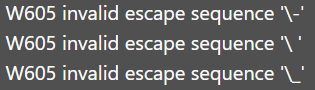
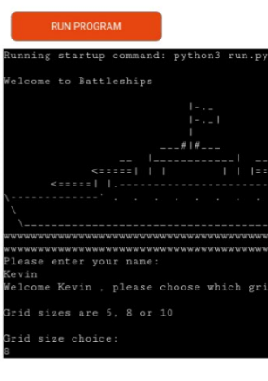
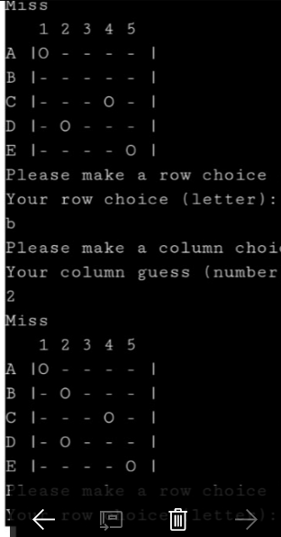
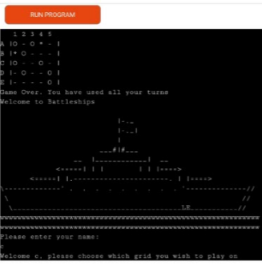
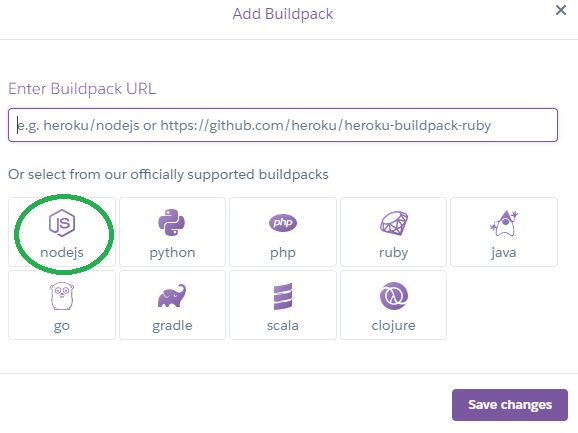

# Battleships game
This game is a single player game designed for users to sink a number of battleships within a limited number of turns in a game of chance. The player must sink all the computers battleships by making estimations on where the computer's battleships are located on a 5 x 5, 8 x 8 or 10 x 10 battle grid. The game provides value to users who are interested in playing online games that provide them with the opportunity of varying grid sizes for increasing difficulty.

## User Experience
### User Stories
- First time visitor goals
1. I want to play a simple game of battleships with clear instructions.
2. I want to see my score displayed as I play through the game.
3. I want the ability to chose the size of the grid and how many battleships.

- Returning visitor goals
1. I want to play using a different sized grid or different number of battlehsips.
2. I want to sink the battleships in fewer turns.
3. I want to play the game without any errors occuring and to ensure the developer of the game is a trusted source.

- Frequent visitor goals
1. I want to see has the developer included additional features to allow the player opportunities to play a two player game.
2. I want to see has the developer updated the design of the site to include battleships image designs for the ships to improve the aesthetics of the game.
3. I want to see has the user included the option for players to save or share their highest scores or a leaderboard.

- Owner goals
1. I want to provide an interactive game that encourages users to play and gain encouragement and excitement from.
2. I want to provide a game that encourages healthy competition amongst users.
3. I want to gain recognition and develop an online presence in the area of online game development.

## Design
The grids are designed to display with the positions allocated by a number and letter system. The grid size displayed depends on the users game choice.
The welcome art including an image of a Battleship was adapted from [ASCII Art](https://ascii.co.uk/art/battleship).

The functions and validation checks were planned and designed with [lucidchart](https://www.lucidchart.com/pages/).

## Existing Features
The user is welcomed to the game where an input requests the user name before the game commences. ASCII Art is used in the welcome message to provide a more aethetically pleasing introduction to the game.

The user is requested to choose the grid size they wish to play. This provides users with the opportunity of changing the level of difficulty of the game.

The guess board grid is displayed. The hidden board has the location of the user's battleships but these are not displayed. A prompt is issued to the user to choose a row position and column position. Validation is in place here so only numbers and letters can be used. Validation is also included to ensure only the letters and numbers displayed can be chosen which eliminates any errors or bugs occuring for the user.

The user's turn number is recorded and decreased when a user makes a guess.
If a battleships is hit the num of battleships variable decreases. This encourages competition amongst users and encourages them to repeat the game if necessary.
A congratulations screen appears whenever a player sinks the required number of battleships or a game over screen is displayed when the user runs out of turns.

## Languages
[Python](https://en.wikipedia.org/wiki/Python)

## Frameworks, Libraries and Programs

[LucidChart](https://www.lucidchart.com/pages/)
- LucidChart was used to design the layout of the game and which functions would be required to run the game including areas where validation was in place.

[Git](https://www.gitpod.io/)
- Gitpod was used for adding commits each time a new feature was added to the game and for pushing the commits to Github.

[Github](https://github.com/)
- Github was used for storing the site after being pushed from gitpod.

[Heroku](https://heroku.com/)
- Heroku was used for deploying the site.

[Youtube](https://www.youtube.com/)
- Youtube was used during the scoping stages of project development to gain insight into the background of the battleships game and different methods employed by developers to code a battleships game.

## Future Features
- I would like to provide users with the opportunity for choosing the number of missiles/turns and the number of ships for varying levels of difficulty.
- I would like to have made the game a two player game, where the first player to sink the genertaed battleships would win.
- I would like to provide a random variable to change the size of the hidden ships on the board and include the ships' orientation similar to the design in the [Python Intermediate Project Assignment Youtube tutorial](https://www.youtube.com/watch?v=MgJBgnsDcF0&t=534s)

## Validation & Testing
[PEP8 Python Validator](https://pep8ci.herokuapp.com/)

When the code was first tested in the validator errors appeared due to the length of lines.

This error was fixed by using the \ operator and indentation. Unfortunately by removing these lines errors this caused the messages to appear disjointed to the user on the deployed site.

This sequence error appeared from the ASCII Art where the \ was interpreted as an escape. This was an easy fix to include two \\ to solve the problem.

## Testing User Stories
- First Time Visitors
- The print messages provide clear instruction however I feel a displayed legend would have been useful and the number of ships should have been made clear to the player before the player guessed positions.
- There was a turn counter incorporated into the game, I would have preferred if a score counter was displayed and incremented each time I hit a battleship.
- I was able to choose the grid size at the beginning of the game however I would have enjoyed choosing the number of battleships.

## Testing on Browsers and Devices

### Browser Testing
The deployed game was tested on Google Chrome and Internet Explorer.
- The layout and positioning are consistent.
- The validation for a user choosing an invalid grid size operates.
- The validation for the user entering valid row and column guesses is working effectively.

### Device Testing
The deployed game was tested on a variety of devices including desktop, HP laptop, Samsung Galaxy A12, A13, A22, S8, iPhone13, iPhone SE2 and Redmi 2201117TY. 
Family members were asked to access the deployed site, play the game and highlight any issues with the print statements, displaying the board and guesses.
The game worked nicely on all Samsung devices and the Redmi device displaying the board and allowing the player to make guesses with no issue.

The display board functioned operated well and the grids appeared clearly on both Samsung A13 and S8 models.

The user could make guesses with ease on Samsung and Redmi devices

When the player took all the allocated turns the game over message appeared.

### Lighthouse Testing
I carried out a Lighthouse test using the Google Chrome Lighthouse function for desktop and mobile.

## Bugs

### Solved Bugs

I had to repeat the above code twice for the different grid sizes whereas by using a board-size varaible I could refactor the code to only write this code once.

After user testing it became apparent that with the 10 x 10 grid the user could not select the number 10 column. This was due to the make_guess validation not including 10 in the checks.

Once the site was depoyed with Heroku it was evident that the checks in the make guess function were not sufficient as a user could enter letters and numbers for the larger grids on the 5 x 5 grid with this check in place:

 

To rectify this issue I included variables for valid numbers and valid letters and used an if else statement to specify which were valid for the varying grid sizes.

I had included the display function within the for loop for generating the ships in the new game function and this was throwing an error and preventing the code from running correctly.

### Unsolved Bugs

I wanted to include a check where the player could not enter the same grid selection using the combination of the for and while loop above. As the hidden board and guess board arrays had been passed into the Board class before this code was run, this was throwing up the following error:

In the end I removed the for loop and this validation check.

I had initially designed the game to be a computer versus player and then a two player game, I tried to use a counter and the modulo operator to switch between player boards but this was causing errors so I removed the counter and re-designed the game to be a one player game for ease of deployment and submission.

IPhone device users had trouble accessing and playing the deployed Battleships game. The game was tested on the iPhone SE2 and iPhone 13.
On iPhone when the input requests the user to enter their name and iPhone users click return the f string does not print to the user. I researched what may be the issue and it appears it a design choice enforced by iPhone that the keyboard cannot input on sites like Heroku.

## Deployment
Heroku was used to deploy the battleships game.

### Instructions
1. Login to [Heroku](heroku.com).
2. Click "Create a New App" on the Heroku dashboard.
3. Enter a unique app name and select a region.
4. Click the .
5. Click "Reveal Config Vars" and add the key PORT and the value 8000 to the 

6. Click "Add buildpack" and select "Python" and select "Save Changes".

7. Click "Add buildpack" again and select "Nodejs" and select "Save changes".

Note the order here is important.
8. Click the Deploy tab and select GitHub as the deployment method and click "Connect to Github"

9. Enter the Github repository by name and click "search".
10. Once the repository is shown click "connect".
11. Click "deploy branch" and wait for the message to appear stating 

12. Click the "view" button to navigate to the deployed link.

## Credits

### Code

[How to code battleship gameboard in python](https://www.youtube.com/watch?v=cwpS_ac8uk0&t=45s)
The code used in this (Youtube)[https://www.youtube.com/] tutorial was adapted to write the display board function based on the user's choice of grid size.

[Battleship - ASCII Art](https://ascii.co.uk/art/battleship)
This website was used to add a design feature of a battleship image to the welcome message at the beginning of the game. The image is displayed using several print statements.

[Portfolio Project 3 Scope](https://learn.codeinstitute.net/courses/course-v1:CodeInstitute+PE_PAGPPF+2021_Q2/courseware/b3378fc1159e43e3b70916fdefdfae51/605f34e006594dc4ae19f5e60ec75e2e/)
This video tutorial from the [Code Institute website](https://codeinstitute.net/ie/) was used and adapted to incorporate the Board class into the Battleships code to set the number of ships, the board type and provide a method to add ships to the hidden board.

[How to Code Battleship in Python](https://www.youtube.com/watch?v=tF1WRCrd_HQ)
The get ships location function in this [Youtube](youtube.com) tutorial was adapted to code the make guess function and incorporate validation checks for the user input.

[Python Intermediate Project Assignement](https://www.youtube.com/watch?v=MgJBgnsDcF0&t=534s)
This [Youtube](https://www.youtube.com/) tutorial was watched for inspiration on the different designs a Battleships game can incorporate and methods that could be introduced to increase the complexity of a battleships game.

### Content
- All content was written by the developer.
- The design of a multi grid size battleship game was inspired by the Code Institute Scope video tutorial, the Knowledge Mavens Youtube tutorial and Python Ninja's battleship game.
- The battleship art displayed in the welcome message was adapted from asciiart.co.uk.

### Acknowledgements
- Thank you to my partner, friends and family for their support and encouragement throughout the project and for testing the deployed game on their mobile devices and providing feedback.